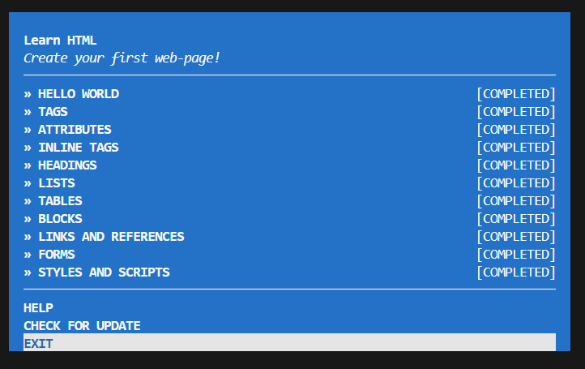

# Assignment 1 – Course Setup

**Course:** CS 800 Research Methods  
**Semester:** Spring 2026  
**Student:** Chameli Dommanige  

## Directory Structure
The `Dommanige/1/html` directory contains the HTML files created while completing the `learnyouhtml` tutorial.  
The `Dommanige/1/styles` directory contains the linked stylesheet used for the styles exercise.  
The `Dommanige/1/` directory also contains this `README.md` file and `completed.png`, which provides proof of completion of the tutorial.

## HTML Workshop
All required `learnyouhtml` exercises were completed successfully.

**Screenshot:**  

**Demonstration Video**
[YouTube Video](https://youtu.be/XeLXkMOHrsg)

